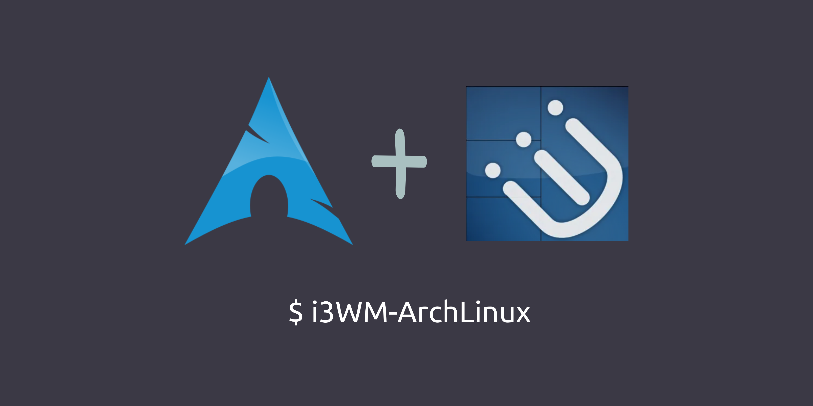

# Arch i3wm Setup

Este repositório contém meus dotfiles pessoais e pequenos scripts auxiliares para configurar e manter uma estação de trabalho Arch Linux. Ele captura minhas preferências de shell, terminal, utilitários e editor para que eu possa reproduzir rapidamente uma configuração de desenvolvimento funcional.
